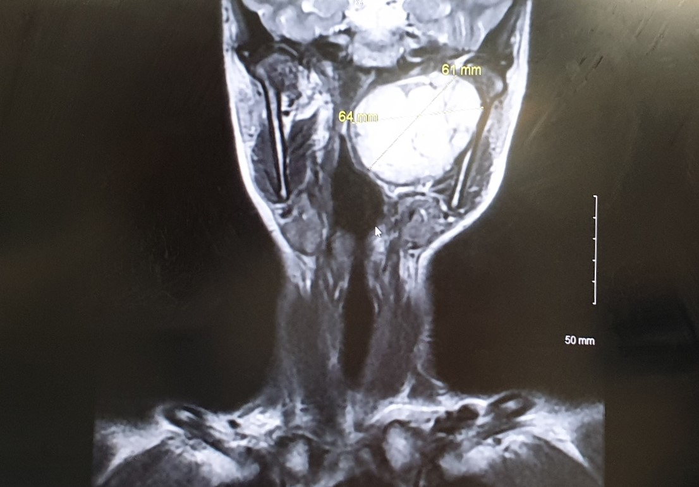

The two-week wait wasn’t that agonising. It really wasn’t.

Back then, for the vast majority of people in the UK, COVID-19 was still a foreign problem. Life just went on as usual. I went into the office everyday, led an independent life, had a healthy complexion, and was full of energy. I felt fit enough to travel to business meetings and found great pleasure in my hobbies. I even enjoyed a dinner and movie night out with a friend less than 24 hours before my fateful hospital appointment.

Was I not worried at all?

Well, the tumour’s mild symptoms didn’t interfere much with daily life. The tumour didn’t proclaim its existence every moment through pain or itch, so sometimes it’s really out of my mind. Having a busy schedule means having less headroom for unhelpful thoughts.

Or perhaps I was reassured by the statistics that most cases of this tumour were benign, so I didn’t have to worry about tumour stage, grading, metastasis or relapse-free survival? Another consolation was that the parapharyngeal space looked pretty cramped in the anatomical diagrams, so the tumour couldn’t be very big? Roughly the size of a table-tennis or golf ball? Would key-hole surgery suffice?

The hospital is close to my office. To make it to the 3:45pm appointment, I just finished the day earlier than usual and covered the outstanding hours with previously banked overtime. 

There were all sorts of people in the packed ENT outpatients waiting room. Middle-aged men attending postoperative follow-up, school-age children fitted with hearing aids, and healthy-looking people, like me. The department was busy with every clinic running behind schedule. That’s fine, time passed quite quickly when one could continue working on the phone. Finally my name was called after an hour’s wait.

The nurse who escorted me said with a chuckle, “you’re special, you know, two consultants wanted to take your case!”

Ha, what an “honour”! So who took me under his/her wings in the end? The consultant who carried out my initial examination?

No. I was greeted by an older, more experienced consultant. A warm and softly spoken gentleman, I reckoned he’s about 10 years younger than my parents. We exchanged pleasantries and introduced ourselves in turns. I told him how I was trained in genetics, have some understanding about tumours, and was a newbie hospital patient. He said he’s old-school and prefers looking after a patient throughout the whole journey, from presenting the diagnosis and treatment options, carrying out the operation, to monitoring the recovery. I didn’t think much of his remark at the time, but finally realised what he really meant a few months later.

“How old are you? 31?”

“Haha, I wish!”

Doctor, you’re so kind! Those were the relatively care-free good old days. I pointed at my personal details on his computer screen, which showed my date of birth and age.

“Oh yes! Well, it doesn’t matter, you’re still young.”

Before we got too comfortable with the small talks, it’s time for serious business.

“So, the MRI scans confirm the presence of a tumour in the parapharyngeal space.”

Yes, yes, that I already knew......

Next, he opened an MRI image file. Alas, you didn’t need to be an expert to tell that the image didn’t look good at all.

I finally saw it. It’s huge!

I kept my composure, “oh dear! It’s much larger than I expected!” While absorbing the shock, I did the typical 21st century thing —— snapping photos of the images with my phone.

“Yes, it’s roughly the size of an orange or a large peach. Exact measurements? Let’s see......”

>6.4 cm across. Half of my face measures 7cm, so the tumour was pretty much as wide as my left face.

How long did it take for a runaway cell to grow into this mass, and with how much nutrients for sustenance? Well, who knows? Budding tumours of this type are often in stealth mode, making them super hard to detect, let alone to track over time. Regular dental check-ups with X-ray examinations wouldn’t help either as soft tissues are “transparent” to X-rays. 

Knowing that I’m teetotal and never smoked, the consultant said, “this is not a lifestyle tumour. It’s nothing to do with your habits or diet, so you couldn’t have done anything to prevent it. The good news is, though, it does appear to be a sheathed, membrane-bound benign tumour.”

Still, I wondered how come the tumour couldn’t be observed or felt from the outside, given its size?

“Ah, that’s because the tumour is boxed up by three sets of bones: the base of your skull, the mandible, and the spine.”

Is surgery the only treatment option?

“Yes, the tumour is too big to be left to its own devices. It’s squashing all the surrounding soft tissues and with time, there is always a risk it could turn malignant. We’ll fastrack the operation. It should happen in a few weeks’ time.”

“As for the operation itself, we have Plan A and Plan B.  Plan A is simpler and more preferable, with an incision that begins at the ear lobe, down the side of the neck, parallel to the jawline, towards the Adam’s apple area. If unfortunately we realise there isn’t enough room for manoeuvre, or there are complications with the tumour, then Plan B will be needed, which is an extension of Plan A, bringing the incision from the Adam’s apple area vertically upwards across the chin. You can either consent to transitioning from Plan A to B prior to the operation, or we can stitch up the incision after Plan A, wake you up, and discuss with you whether to proceed with Plan B.”

I responded with a wry smile, “well, if surgery is the only option and Plan A doesn’t work, I don’t really have much choice but to proceed with Plan B, right? What’s the point of waking me up and then reopening the wound again? Of course it makes sense to do it in one go.”

He continued, “the main risk of this operation is accidental damage to major cranial nerves which control all sorts of key bodily functions, such as digestion, speech, swallowing and taste. But we’ll try our best to avoid such complications. As for the scar, with Plan A, it’ll be similar to what happens after a facelift —— very faint and well hidden in natural neck folds. There’s a good chance that we stick to Plan A anyway.”

We covered a lot of ground in 40 minutes. I had never had so much time to discuss something as thoroughly before with an NHS* doctor. At no point was I rushed, despite the clinic clearly running behind schedule. As we said goodbye, I wasn’t burdened with  unanswered questions; rather, it felt like the end of a lecture class on tumour surgery.

So...... table-tennis? Golf? No, it’s tennis!

Keyhole surgery? Forget about it. Free facelift, anyone?

Looks like I haven’t done my homework properly this time......

*The National Health Service in the UK, a publicly funded healthcare service that is free at the point of use.
