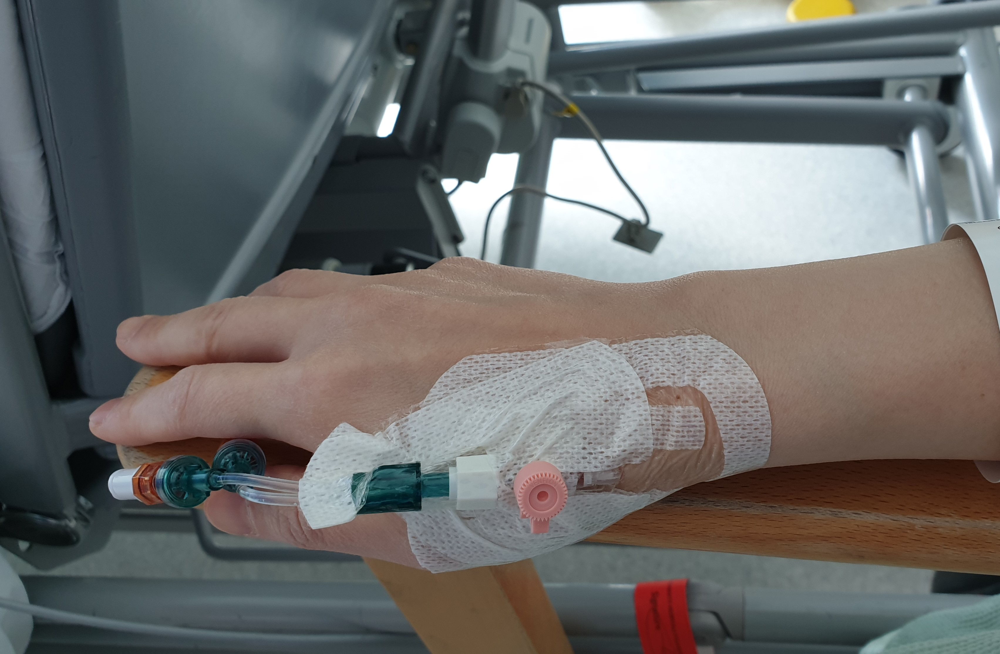

大日子終於來臨。早上七點鐘就要到醫院報到，平日晚睡晚起的我，未到六點鐘就起來梳洗。這個很重要，因為不知道手術後多久才能如常洗頭洗澡。之前一晚沒怎麼睡好，腦海不停重播過往幾個月的種種經歷。也不打緊，手術期間保證睡個飽。
 

在醫院「日間手術部」大門外的前廳，疏疏落落站著、坐著像我一樣獨個兒等候被召去報到的病人。因為疫情關係，醫院勸諭病人盡量不要攜同親友來陪伴，就算在前廳等候時也可免則免。大家看來和我一樣，很正常啊，行動自如，臉色不錯。誰說病人一定看得出來？
 

為何那麼八卦留意四周的人？我想看看他們有沒有帶手機！
 

醫院《入院須知》提醒我們不要帶貴重物品，包括手機。大概是擔心意外損壞、丟失或偷竊？廿一世紀了，沒手機傍身諸多不便，怎麼辦？朋友都說別管了，當然要帶手機！醫院不是學校，總不會沒收手機直到出院吧？
 

原來在重要關頭，大家都很聽話，沒帶親屬陪伴，但就是不肯放棄手機！人 vs 手機，首回合，0:1。
 

「日間手術部」是一個很長的病房，有一條走廊為主軸。長廊左邊是一間間小病房，房內有四張床，疫情前，不用保持「社交距離」，那裏大概可以多放至少兩張床。長廊右邊看來有辦公室、小手術室、洗手間，還有通往大手術室的門。
 

我被安排與另外三位姐姐在同一個小病房內等候。她們全都身經百戰（有一位甚至已做過三十多次手術），對入院流程、手術前後的大小事都瞭如指掌。反觀我這個初入大觀園的初哥，簡單如穿醫院袍也有點手足無措。
 

「為甚麼他們給我兩件袍？是兩個不同尺碼，我選其中一件？」

「不是，兩件都要。一件蓋著前面，另一件蓋著後面，那就得體些 （“for some decency”)。」

啊！原來醫院病人袍就像一件只有前半截或後半截的女裝睡袍......

我大部分時候都在自己的床位，半坐半躺，如何不「得體」啊？直到我要離開床位，走幾步路往洗手間……我明白了！我不要背部坦蕩蕩任人看啊！

你看，除了手機，我真感謝有幾位姐姐相伴。人 vs 手機，次回合，1:1。

還未到八點鐘，我就瞧到我的主診醫生 Mr J 在長廊經過，邊走邊輕問護士拿我的病歷本。那麼早就到？我的手術是不是安排在早上？

約十五分鐘後，Mr J 就拿著手術同意書來到我床邊。除了看看我狀態如何，也重申他們會盡量用 Plan A，如無意外復原會挺快的。

我記得 Plan A 需時三小時，打算如是告訴父母。Mr J 卻分享經驗之談：

<q class="cn">啊，你跟他們說三個半小時吧！你看，若手術順利、準時完成，他們比預期早接到電話，就欣然鬆一口氣。但如果手術進度比預期慢一點點，那至少他們不用擔心手術是否出意外了。「期望管理」(expectation management) 嘛！

對啊，手術期間我不省人事，管他三小時還是三個半、五個半？但憂心等待的一方卻是另一番滋味。想不到 Mr J 連這小事也想得周到，我當然照他的吩咐辦。他又詢問我父母的名字、聯絡電話，以通知他們手術結果。我心想，醫院官方紀錄有我的近親資料啊，在那裏找不就可以了嗎？為何要親自記下來？也無所謂，可能是禮貌上順帶一問，畢竟他一直都很關顧到我父母。

說來，為三位姐姐送來手術同意書及講解手術細節的都是護士，唯獨我有主診醫生親自來訪。是我的手術特別大陣仗，還是又是 Mr J 當日所指的「一條龍」服務，特別貼心？

當日另一位重要人物是熟讀我手術計劃的麻醉師。他特意來解釋插麻醉藥導管的位置，並說由於手術可能要臨場變陣轉 Plan B（下頷開刀），所以，麻醉後他們會用鼻喉輔助我呼吸，而非像其他同類病人一樣張開口來放喉管。鼻喉可能會擦傷喉嚨，所以手術後可能會有短暫喉嚨痛。

「有沒有其他問題、要求？」他微笑著說，眼神真摯，這不是循例的結語。

「沒甚麼，只要我手術期間別醒過來就行！」

「啊，大部分病人都這樣說，哈哈！」

同房的姐姐一個一個出發往手術室了。到中午左右，就只剩下我一個。十二點半。一點。一點半。護士還未喊我的名字啊！我嘀咕，何時才輪到我呢？遲了開始，會不會到晚飯時間才完成手術、送我往病房？爸媽要趕著來探望，或許會打擾他們的晚餐了。

我絕對不是陳奕迅《謝謝儂》那種「躺在病床上動也不想動」的病人，反正躺躺坐坐一個早上了，就去長廊走幾步吧。

<blockquote class="cn">那才發現，原來整個「日間手術部」的小病房都差不多沒人了！</blockquote>

心情猶如一個幼稚園學生等家人來接放學，我的同學都回家了，我卻還在等啊！
 

兩點半。終於。
 

護士領著我往手術室。短短的一程只需幾分鐘，要經過幾扇門。走著走著，在想甚麼？沒有，腦海一片空白。未幾就到手術室。雙葉門一敞開，只見手術檯被群燈拱照，手術室內有好幾個我未見過面的醫護在忙碌穿梭，還有一種不尋常的熱鬧。就是不見 Mr J。
 

難怪英文把手術室稱為 operating “theatre”。我這個手術初哥就像第一次參加電視台才藝比賽的人，由工作人員從後臺領到燈光聚焦的舞臺，短短一段路，腦海同樣一片空白！
 

還未看清楚手術室四周的人和「風景」就要上手術檯！甚麼，原來要自己爬上去的！？如今想來，其實那很合理。明明四肢健全，有氣有力，幹嘛要醫護抬我上去？
 

那用來「遮醜」的背面袍阻礙手術，要脫掉。他們手勢純熟，我也管不了尷尬不尷尬，反正，誰有心思看病人走光不走光？
 

躺下來了，暫時不走光，哈！（按忍者匿藏位置，手術時我應該是全程側身，而不是平躺。）之後的一分鐘，先是另一位女麻醉師拿走我的眼鏡和口罩，然後是護士請我再一次確認名字和出生日期，再接下來就是麻醉師說要放藥了。

一針，快而準。

<q class="cn">啊，你手勢真快！開始有點模糊了......
 

來不及說「藥力越來越厲害了」，我就不省人事。幾個月的漫長等待，不消五分鐘就畫上句號！

與麻醉師再對話，是三個多小時之後的事。