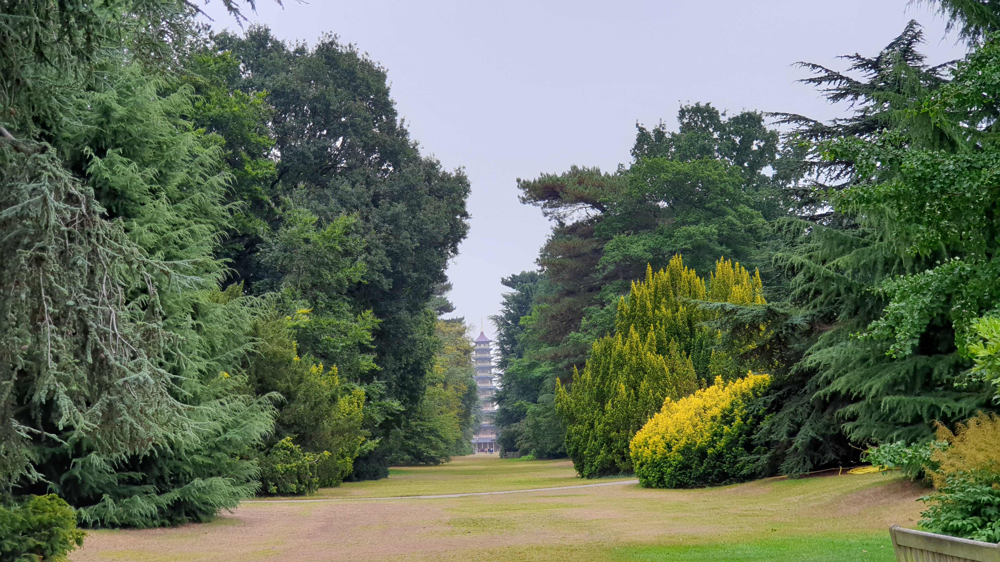

The ninja. The operation. Tsunami warning. My operation turned out to be a pretty easy surf on a warm sunny day, with just the right “kind” of waves, just enough ups and downs to get your adrenaline going but no real scare.

The month which followed this surf was the British midsummer, which also marked the beginning of my first long holiday since graduating from university. There’s definitely a novelty factor in this new routine of a leisurely, low-stress life, free from exams, assignments and work responsibilities. I felt a little bit bad as I spent hours on lunch and strolls while many of my peers were busily working from home. Well, my excuse was that my jaw was stiff and I couldn’t eat quickly as I used to. But then, I don’t resent being slow; it reminds me of the pace of life when I travelled in Taitung —— it’s slow, leisurely but still productive.

Thank goodness we had some proper summer weather! (You know, British summer temperatures sometimes could feel autumnal, as if summer never arrived). With the pandemic easing somewhat and the government’s “Eat Out to Help Out” discounting scheme, I took the opportunity to meet up with friends and family every few days over something tasty —— Japanese, Korean, Indian, Turkish, Polish, Thai, Italian, Shanghainese. From not being able to fit a whole piece of sushi or a whole cherry tomato into my post box aperture-like mouth at the beginning, to easily stuffing myself with Korean lettuce rolls a few weeks later, my dining experience was testimony to the easing of trismus.

I also took a day trip to the Kew Gardens in London, a city that I used to visit and know so well but stayed away from for it’s an international travel hotspot. Gone was the hustle and bustle; train and tube carriages were as empty as travelling at midnight during “normal” times. The capital city at a slower pace inadvertently aligned with my new routine. While at the botanical garden, my neck kept reminding me that my surgical wound hasn’t completely healed, since my head felt so heavy whenever I tried to lift and tilt it backwards to appreciate some tall plants. It felt much better when I supported my head with my hands to ease the strain on my neck muscles. Having said that, my stamina wasn’t that bad actually, as I effortlessly clocked up some ten kilometres on foot that day, which was a good indicator of how my physical health was recovering.

Was hedonism part of my “new normal”? I guess you can say so! With no rush to get out of bed every morning, happy times passed quickly on the piano, on crocheting, in the kitchen and in my strolls. My plan back then was to have a four to six weeks’ break post-op, just focusing on my recovery, and then gradually phase back into work by the autumn.

Life rarely turns out the way you planned.

One evening, I was about to set off for a Turkish dinner with a friend when my phone rang. It’s from the hospital. Umm....... my one-month post-op review was still a week away, why the call, and why after office hours?

It’s from Oncology. The caller didn’t introduce her role in the team, so she could be a doctor or a nurse. She spoke quickly, but I caught all the key points:

>The biopsy results showed that there is a small cancerous part in your larger tumour. It’s a low-grade, early-stage cancer, so please don’t panic. This will not affect your radiotherapy schedule. We’re calling today just to let you know about the biopsy results as soon as possible, ahead of your appointment next week.

Oh.

Should I congratulate myself on winning the lottery jackpot again? “Lightning doesn't strike the same place twice”? It does! Parapharyngeal space tumours are rare, of which about 80% are benign, but hey-ho, mine wasn’t! The tumour has transformed into a malignant one, and the transformation rate was unknown.

Oh my dear ninja, when did you turn malignant?

Some friends and relatives were puzzled by this sudden revelation, for they had this firm impression that the tumour must be benign; they wondered if the transformation would have happened had my operation not been postponed due to COVID. Well, who knows? Perhaps some tumour cells have always been malignant since the very first day I saw the lump, or indeed some malignant cells started accumulating while I was waiting for the operation. It’s impossible to say for sure without any biopsy results from earlier timepoints, so there’s no point in pestering the doctors on why or when. After all, multiple signs from the scans and the operation have been consistent with the ninja being benign. One could only say that the ninja hid it really well from us!

Was this a blow? It somehow didn’t feel that way. “A small cancerous part in your larger tumour” didn’t sound too serious? Strangely, the prospect of radiotherapy never really registered in my mind, unlike the operation which loomed over my head for months. Mr J did say clearly that “radiotherapy would follow even if the tumour was confirmed to be benign”, but it was as if I had no recollection of this remark at all! Radiotherapy never felt imminent, even though it actually was.

Fine and dry? It’s just some precious breathing space before the torrential storm. I had no idea that my 6-week sick leave would have to be, involuntarily, extended to a year......