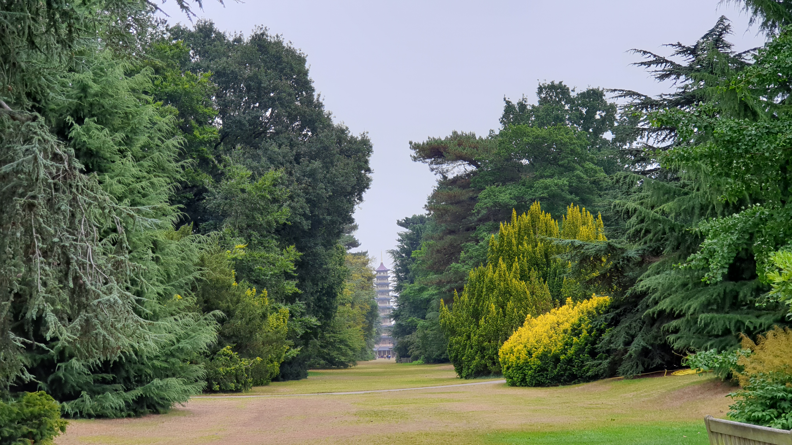

忍者、手術、海嘯警報。開刀猶如在陽光普照下滑浪，有起有伏，但總算有驚無險。

衝浪過後的幾個星期正好是仲夏，也是我自大學畢業以來第一個長假。第一次如此賦閑著，沒有讀書考試或承擔工作責任的壓力，起初感覺蠻新鮮的。尤其當明明是大好工作天，大家都在拼搏的時候，我卻施施然去散步、花幾個小時享受午餐，我是否應該覺得不好意思呢？我的藉口是嘴巴不能完全張開，進食速度確是慢了些。慢也沒甚麼不好啊，我在台東旅行時最愛就是那種慢活的節奏。

難得天氣不是寒風細雨、晦氣那種（英國的夏天，感覺有時像秋天......），疫情放緩，又適逢英國政府為振興經濟而推出全國食肆折扣優惠，我就趁機每隔幾天與親友相聚，吃些好東西，日本、韓國、印度、土耳其、波蘭、泰國、意大利、上海菜都有。由起初嘴巴像郵筒口那樣扁扁的、不能把整塊壽司、整顆櫻桃番茄放進嘴裏，到後來很輕鬆的吃韓式生菜包肉，那就是左顎肌肉逐漸康復的證據。

也趁機到久違了的倫敦一趟，遊覽著名植物公園 —— 邱園。多年來我習慣了倫敦的車水馬龍，如今換上冷清的火車、地鐵車廂，猶如以往夜深歸家的境況，卻也配合我慢活的新日常。在園中舉頭看花看樹有些難度，脖子覺得頭重甸甸的，很容易失平衡，提醒我傷口未完全癒合。如果用手托著頭才往後仰，那就舒服不少，減輕頸部肌肉的負擔。話雖如此，那天竟然不知不覺走了大概十公里路，可見體力恢復了不少，健康其實不算太差。

就只是吃喝玩樂的日子罷了？是的。睡到日上三竿、彈琴、鉤編、下廚、散步，日子過得快，也愜意。那時候的打算是手術後放病假四至六個星期，不求積極進取，只求好好休養，到秋天時慢慢復工。

人算不如天算。

還記得那天傍晚，我正準備出門與朋友吃土耳其菜。電話忽然響起 —— 是醫院打來的。離手術後覆診還有一個星期，醫院為甚麼忽然來電，而且是過了正常辦公時間？

是腫瘤科。來電的人沒有報上職銜，不知道她是醫生還是護士，說話有點急，但重點我還是聽清楚了:

<blockquote class="cn">化驗報告結果顯示腫瘤小部分細胞屬惡性，是「低級別」、早期癌症。因為發現得早，所以請無須恐慌，這也不會影響你的放療安排。今天來電是想早一點通知你，不用等到覆診那天才得知。</blockquote>

啊。

我不是說過：「總不會連中兩元，來個惡性的吧？」哈，我第二次中頭獎了！Parapharyngeal space 腫瘤本身已甚罕有，文獻說大概八成是良性的，可我的偏偏變惡了。我說「變」惡，是因為不少惡性腫瘤的前身是良性的，那「變壞」的過程可長可短。

忍者啊，你何時變得那麼壞啊？

有親友不禁問，明明說好是良性的，怎麼會忽然變惡，是否遲動手術之過？這個呢，真是天曉得！可能早在一月、我遇見它那天已是惡性，又或是春夏間、手術延誤的那幾個月，腫瘤逐漸累積惡性細胞；但由於等待期間沒抽樣本化驗，所以沒人能說得準，不能一口咬定是疫情拖累，也就犯不著死纏醫生苦苦追問。忍者一直扮乖，掃描、開刀都看不出它變壞了的痕跡，所以也不能怪醫生疏忽。

這算噩耗嗎？我又氣定神閑了。「小部分細胞屬惡性」，那好像不太嚴重？不知怎地，相比於手術前如臨大敵，我倒從沒把放療放在心上。主診醫生早說過：「就算是良性也要放療」，我卻彷彿毫無印象似的！那本來是迫在眉睫的事情，我卻覺得很遙遠......

雲淡風輕？那只是暴風雨前給人喘息的縫隙。我萬萬沒想到，原定六星期的休假，後來竟然要延長到一年。
