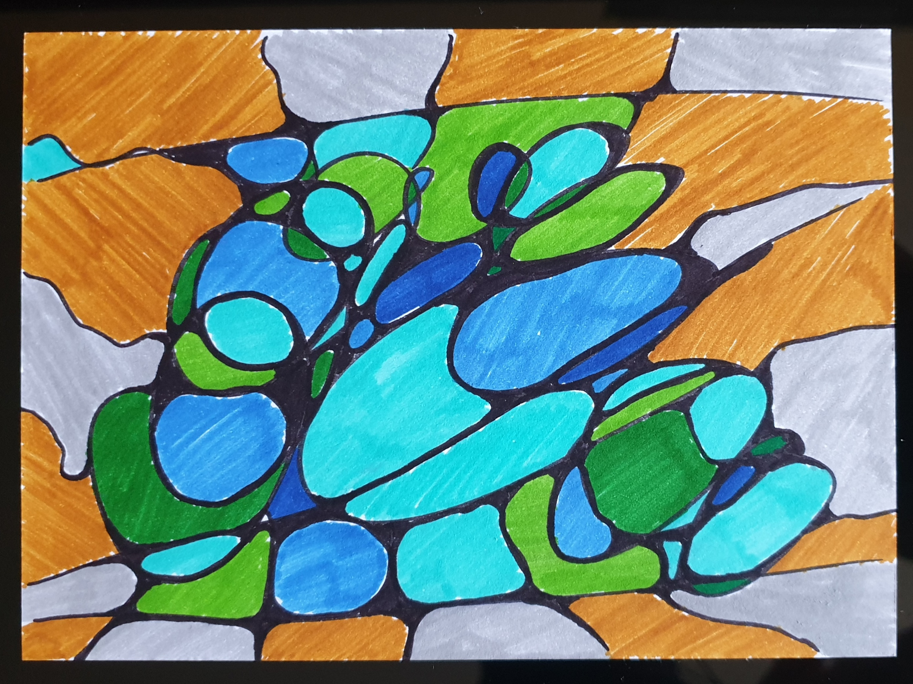

With no significant changes in my physical wellbeing during the first week, I thought my healthy cells were catching up with rebuilding what’s destroyed inside the mouth by every dose of radiation and managing the repair deficit at a low level. It turned out to be an illusion.

As the second week of the radiotherapy regimen began, I still had no idea how I was gradually losing my sense of taste. I remember grabbing a sandwich and a salad at Pret A Manger one day for lunch, and found the food not as enjoyable as expected, which made me think that the chain’s food quality had declined during the pandemic. It was many weeks later that I woke up to the fact that what’s changed was not the food, but my taste buds! Meanwhile, isolated irritated patches started to appear in my throat, accompanied by a slightly drier mouth, as well as a budding ulcer in a really secluded location: along the left edge of my tongue at the very back, where it meets the left wisdom teeth’s gum and the throat. Despite all this, I was still having a largely normal diet.

Fast forward a few days, the huge imbalance between repair and destruction was stark. The rapidly deteriorating radiation damage was way too much for the healthy cells to keep up with. How devastating was it? Well, where shall I start? My sense of taste was completely lost —— everything tasted salty. The entire throat mucosal surface was badly fraying with open wounds and inflamed, so there was no escape from any pain whenever I ate and drank. Even swallowing one’s saliva was painful. This wasn’t a normal sore throat that could be relieved by taking honey or lozenges. The secluded ulcer felt like a bully standing in the way of everything I needed to do: eating, drinking, swallowing saliva, speaking, or something as simple as yawning, and its response was always in full anger. Which posed a problem to the next side effect as my salivary glands were battered: dry mouth. To drink (water) or not to drink, that’s the question. I couldn’t dodge pain either way, I couldn’t win.

I was merely a third through the regimen, not even at the half-way mark yet. More of such dilemmas and catch-22s were to come. Since then, hardly a day passed by without me weighing the pros and cons of various strategies to manage the interconnected side effects, and eventually making some difficult decisions.

As radiation damage took hold, my appetite diminished, and my energy level nosedived. I was still playing the piano occasionally for some respite and distraction, yet it would only take a small, reflexive action like swallowing saliva to bring me back to reality. The body took every opportunity to protest that something wasn’t right.

You might have noticed that I have written quite extensively about pain in this chapter.

>Yes. My miraculously pain-free experience had come to an end. I was demoted from the pain-free heaven straight to hell.

By now, we’ve reached the third week. Radiotherapy continued to take its toll on my normal bodily functions. I was ready to give up the long drive to and from the hospital. Simple household chores felt laborious. I prepared meals, but eating them was a struggle. I knew I had reached the tipping point for me to forgo my independence and relocate to my parents’ home indefinitely; what I needed was tangible support instead of holding onto some sort of pride. (No wonder why the consultant oncologist wanted to confirm that I had family support prior to diving into the details of radiotherapy.) My parents obviously bore the brunt of my care, but were also relieved by my physical presence in the house. Seeing is believing (that I was OK), right?

My mouth was really a mess. I quickly switched to the kind of soft and moist diet recommended in the patients’ brochures, hoping that would ease the discomfort in chewing and swallowing. A few radiographers also mentioned how some patients could eat curry throughout radiotherapy —— ah, that’s pretty moist, right? Unfortunately, the reality was that pretty much all solids were too irritating, no matter how pureed and rich in sauce they were. I often had to spend half an hour, sometimes up to an hour, to finish what would have been a five-minute quick bite, in tiny mouthfuls. There were long pauses between each mouthful as I waited for the pain to wane. If you’ve watched Man v. Food before, this is similar, just the miniscule version, and no fun at all......

Next in line in the long list of side effects was candida infection in my mouth. The normally harmless yeast proliferated profusely, taking advantage of an immune system weakened by radiation that took a path through the mandible and lymph nodes. With this additional layer of infection, the oral ulcers and inflammation didn’t get much chance to heal at all. To reduce further wear and tear in my mouth and tongue, I started speaking only sparingly. Communications took the form of instant messages in apps, scribbling on some scrap paper, or hand gestures. I did wonder if the relief brought by smartphones to modern cancer patients was comparable to the joy of astronauts in the International Space Station connecting with their loved ones on planet Earth via the internet? 

Painkillers finally were deployed. Not opioids such as codeine or morphine, but just common off-the-counter ones —— paracetamol and ibuprofen, used alternately. Were they effective? I wasn’t sure actually. Sometimes they seemed to have helped, halving the pain levels, or knocking off 70% of the pain on a lucky day, giving me a precious 30-minute or so time-window to eat; but more often than not, the analgesic effect would have waned before I finished my meal, so the last few mouthfuls were usually more of a struggle. On bad days, the medicine didn’t seem to have much effect at all; I as a scientist had no explanation, nor did I have the energy to dig into it. Oh well......

Pain is such a private and subjective experience. I had little control over how my brain wanted to process the nerve signals from my mouth. None of my distraction tactics worked. I was out of ideas. 

The kilo or two I put on before radiotherapy was burnt off with all the feeding and appetite issues. I wasn’t taking in enough calories to keep warm. The seasonal trench coats, now totally inadequate for early autumn, were replaced by the thick coat I normally wear when travelling to Northern European countries in sub-zero temperatures, together with a layer of cashmere jumper underneath. That outfit probably effused fragility all over, and I stopped being mistaken as a member of staff. 

Should I just let radiation ravage through my mouth and immune system? There were another three and a half weeks to go —— how much longer could my healthy cells endure this ordeal? It’s then I remembered that my trusted traditional Chinese medicine (TCM) doctor said he could help if the side effects were severe, to lend my healthy cells a helping hand in this so far one-sided, uphill struggle. The TCM treatment would also hopefully prevent my general health crashing to the rock bottom, allowing a faster recovery from all devastations in the aftermath of radiotherapy.

Blessed was I to be in the safe hands of my TCM doctor (who’s also trained in western medicine) and my trusted consultant surgeon Mr J. For the remaining radiotherapy sessions, western medicine and TCM complemented each other; I did pull through in the end.
