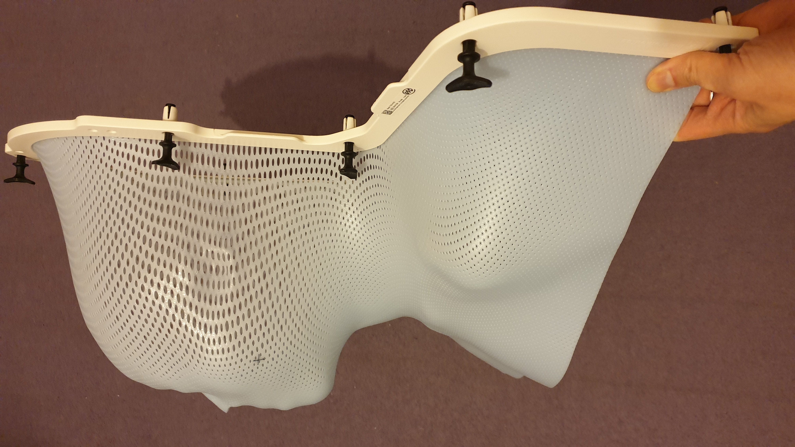

踏入第六個星期，亦即最後五天放療。終點在望，繼續努力保命。身體狀況若不急劇變壞就謝天謝地，從不敢奢望它會好轉。

本來好端端的，以為可以安然度過最後一個星期。豈料任憑我再小心也被口水漏夜偷襲，咳嗽不停，喉嚨受重傷；以往尚可於清晨趁口水分泌減少時小睡片刻，如今則整日不得安寧。最嚴重的兩天，止痛藥全不管用，我幾乎連去放療部報到也無法自己開口報上名來，也不能吃喝「保命」，每天唯有靠幾瓶醫院配方的營養劑度日。喝光每瓶只需三十秒；三十秒，我撐得住。

痛楚加劇，會否惡化，延至放療完畢的康復期？我用布洛芬與撲熱息痛一直頗克制，從不達到每天安全劑量的上限。應否加重劑量，又或者試用其他藥理不同、或更強的止痛藥？醫生其實一早把嗎啡列入我的處方，有備無患，只是我一直沒有去醫院的藥房提取。細看處方，發覺嗎啡一項沒注明何時開始可以去拿，我擔心藥房會拒絕給藥。放療早期就曾遇過這情況，有一次我快用光漱口鹽，打算去藥房取，可是職員說處方沒注明下一次發藥的日期，要我找醫生批注。疫情期間，醫生不好找，就此耽擱了好幾天。

事到如今，是時候考慮試用最低劑量嗎啡。放射治療師曾告訴我，很多病人踏入第三個星期療程就要開始服用與嗎啡同科的可待因。我一直只靠普通家常止痛藥，實在是異數。嗎啡處方要在第三十日搞清楚，確保所需藥物都帶回家，因為療程結束後就不會天天去醫院，我不想麻煩家人特意到醫院跑一趟替我拿藥。

之前的二十九次治療，我都無需陪同。然而，到了第三十次，亦即最後一次，喉嚨狀況極差，人虛弱到極點。不得不煩請妹妹陪同往放療部做我的喉舌，確保康復期所需的藥單無誤，要提取的藥物都點算清楚。

在漆黑中陪伴我六周的面罩，每次治療後都安放在放療室的架上。整個療程結束後，醫院可銷毀它，亦可給病人帶走做紀念品。聽說有病人把它加工變成藝術品，我卻沒此才情。

我決定把面罩帶回家。其實也沒甚麼點子，也不打算在家裏掛在牆上，不過，就是覺得這面罩彷彿是我的分身，毀掉它不太好。

壓軸治療開始前，我跟放射師說：

<q class="cn">我今天要把面罩帶回家。

「哦，要完成療程才可拿走啊！」每個放療師要照顧很多病人，不可能記住每個人的治療進度。

<q class="cn">今天不就是最後一天嘍。

放療師馬上看看病歷。「噢！確是！」

是時候介紹與我共患難三十天、前後一共十多位放療師。他們兩人一組照顧我，全部都像病房的醫護一樣友善，從不板著臉，亦有問必答。我就是從他們口中知道原來每次放療的劑量、角度都一樣（腫瘤科醫生沒提過此細節），也多虧他們有一次趁有空檔給我看看當日的 CT 掃描影像，看輻射場設定的形狀、強弱分佈。原來輻射場覆蓋範圍很廣，怪不得副作用多多。

放療師除了一貫的瞄準輻射，把副作用減到最輕外，在疫情期間他們更謹守崗位，儘管每天與無數癌症病人有近距離接觸也不迴避，實在可敬。雖然說全部病人於療程開始前必須通過 COVID-19 測試，而且大部分像我足不出戶，但病人畢竟免疫力較弱，在療程中不幸染疫而不自知（尤其是初期）還是有可能的。病人在治療檯上戴面罩時不能同時戴抗疫口罩，有時放療師詢問面罩鬆緊，不能只靠手勢回答，就不免要開口答話。要知道那時候 COVID-19 疫苗還在臨床測試階段，距離英國大規模替醫護接種還有兩個月。所以，一眾放療師還是要承受被傳染的風險。

或許是抗疫關係，要減少病人、醫護反覆觸摸的東西，放療室沒有屏風或簾了遮擋的更衣間。男病人或許不太介意，但女病人呢？幸好，每次遇上男放療師當值，他們會在我準備脫上衣時自動轉身背向我。其實我也是背向他們的，他們有沒有偷窺，我不曉得；說實在的，也沒甚麼好看吧？但他們這看似微不足道的舉動就令我覺得被尊重，免除尷尬。感謝 NHS 培訓出幾個非常專業的男放療師，對我這個女病人從不渾水摸魚，亦從不無故打量。試想想，放療期間我身心俱疲，面罩固定上身動彈不得，若遇到上下其手的敗類，我當然可以向醫院投訴，但那多費力氣，費心神啊！

<blockquote class="cn">最後一劑輻射終於掃射完畢。</blockquote>

面罩除了是接受治療時的近身伴侶，也像是馬拉松運動員衝線後頸項上的獎牌，是跑畢全程的標示，是一種肯定。能攜著面罩走出放療部的都是生還者。

我就是生還者。

妹妹與我離開放療部，徐徐走著，面罩引來沿途醫護的祝福與鼓勵。在走廊，我竟然巧遇當日替我做罩的放療師！難得她在眾多病人中認得我，就多聊幾句。我還記得那天做罩完畢她送我走，臨別前她特別叮囑，放療期間遇上大小副作用千萬別啞忍，要馬上求助，他們一眾醫護都不會怠慢。雖然說西藥在這方面對我的幫助不大，但醫院方面確實對副作用嚴陣以待，放療師所言非虛啊！

曾有一位資深放療師對我慨嘆，他們多數只目睹病人在療程期間越變虛弱，至病況到谷底時偏偏是療程結束、大家要分別的時候，病人一副劫後餘生模樣。本來是天天見面，忽然變成不知何時再遇，難免有點不捨。他們都期盼病人早日走出谷底，然而甚少有機會看到他們康復後的神采。

放療師，非常感謝你們的照顧。我們就此暫別。別感傷，我會回來探望你們的 —— 我說真的。