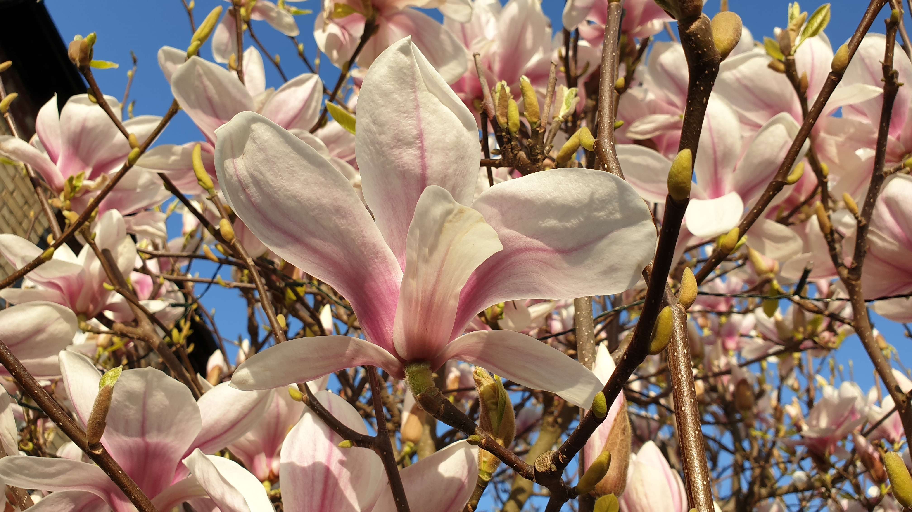

三月。春意盎然，日照漸長。

 

木蘭花季也開始了。我最愛木蘭，不只因為它於初春怒放奪目，在嫩葉長出前就霸佔全部枝頭，還因為之前的冬天越嚴峻，木蘭就開得越燦爛。熬過手術和放療的打擊，我不再追求像木蘭一樣遇強越強，但如何才算活得燦爛？談退休實在太早，談復工又未是時候。
 

休假九個月，為何還未是時候？放療副作用沒全退，生活難說得上「正常」。單是口乾、喉嚨痛這兩個問題就令面試對答也覺吃力，更遑論開會、報告。另外，又是拜輻射所賜，驗血報告結果顯示我體內抵抗病毒、細菌入侵的淋巴細胞（白血球的一種）和它們的鼻祖都被殺得所剩無幾。若傷風、感冒或 COVID-19 趁火打劫就很麻煩，尤其當我的喉嚨一帶黏膜還有傷口。雖然免疫力比常人低，但我畢竟不是血癌或接受化療的病人，免疫系統不被癌細胞或藥物壓抑，遲早會復原，不算高危，遂沒優先權接種 COVID-19 疫苗。「幸好」康復期間屢次封城，除家人外，我甚少接觸其他人，又無須進出醫院，被傳染的風險還是蠻低的，但若重返辦公室（就算只是一星期一次）就令風險倍增。
 

還有之前沒多留意的頸淋巴滯留問題，是頭頸癌放療常見的副作用。滯留的主因是輻射把頸部一帶的淋巴管、淋巴核都毀了，淋巴囤積在皮下軟組織無法流走，形成腫脹、疼痛。下頷與頸的腫脹雖然在外，卻不顯眼，不摸就不痛，倒沒太大所謂。可是，喉嚨的扁桃腺本身就是淋巴核，扁桃腺腫脹直接引致喉嚨不適（猶如有異物哽咽）和聲音沙啞。此外，淋巴滯留的話，白血球就不能暢順遊走全身偵測病毒、細菌。這樣一來，就算他日打了針，疫苗能否發揮功效呢？
 

大家可能會聯想到減肥廣告推銷的「通淋巴」療程？那不少是偽科學的噱頭，我這個卻是實實在在的醫學問題啊，請別張冠李戴！
 

就趁與 Mr J 遙距覆診請教一下吧。他說那些腫脹再過些日子會自然消退，平日多做運動，促進血液循環有助推動淋巴，同時亦可增強免疫力，一舉兩得。而縱使淋巴系統運作不太順暢，那也不嚴重影響鼻、咽喉應付呼吸道感染的能力，疫苗照樣有效，大可放心。他知道我這個年紀的人還未輪到打針，就帶點不好意思的說自己去年底已接種了兩劑疫苗。他是前線耳鼻喉專科醫生，若還未打針我才擔心呢！
 

四月。「斷捨離行動」早結束了，賦閑的時間又見充裕。有時真的忘了是星期幾，反正沒啥分別，沒有日程表要依循，沒有工作「死線」要追趕，天天慢活。復工無期，但有時還是會發白日夢。幹老本行好，還是轉行？多棲？
 

養病期間，除了彈琴、鉤編、做菜、試菜和休息，還有甚麼活動夠充實，無須用口，又有助康復？
 

散步。
 

那時候，口腔潰瘍康復到了一個階段，可以接受口香糖的薄荷而不覺刺激，我外出時嚼口香糖就不用頻頻喝水治口乾，比幾個月前自由、方便得多啊！既不用擔心太晚出發而來不及天黑前歸家，又無須限時回家用廁所（荒山野嶺一人之境，何來公廁？），走遠一些也無妨，尤其是天氣好的日子，由起初的三、五公里增加到十公里以外，越走越起勁，順便當作物理治療處理淋巴問題！再加上英國政府向全民免費派發簡易 COVID-19 側流抗原測試 （lateral flow test），我每隔幾天在家自行檢驗，在外面就算多走走、偶爾接觸陌生人也安心一些。
 

找木蘭去。河邊、大街小徑、於疫情中兀立不倒的小店、陌生人的花園、富貴人家的大宅、農田、木林、小丘 —— 凡沒有標示「此路不通」、「閑人免進」的，我這個城市人都「另闢蹊徑」去探索、去八卦、去見識。世界多大！
 
<blockquote class="cn">最神奇的是，每次去走走，本來沙啞的聲線就開了，萬試萬靈！</blockquote>

就是那時候開始，我愛上了散步。
 

儘管每天都開開心心散步去，腫脹卻沒怎麼消退的跡象；是時候請教中醫師了。這次無須服藥，針灸就可。針灸兩次，頸內外腫脹都明顯退了。心理作用？又或許是持續物理治療的功勞，純屬巧合？針灸與物理治療相得益彰耶？都不重要，退了就好！
 

四肢要運動，腦袋也要啊。寫此小書就是一種鍛煉。又試試學外語。人家說沒有測驗、考試評估，沒有日常應用的機會，外語怎會學好？多數半途而廢！我才不管，哈哈！我就是喜歡這樣，學習進度由我，無壓力，無目標，無大志，隨心所欲，純粹玩票性質！在音樂領域我也想有新嘗試。無意中看到鎮內有人廉價出售藍綠色的二手木結他，就把它買下來玩玩。常聽說結他不難學，我也來試試吧。就算失敗了，留它在家中當音樂擺設也好啊！時至今日，我說不上「彈」結他，只是約莫摸這兒撥那兒，但我享受與弦和共鳴箱的親密感，絕對是豐富了音樂體驗。
 

就這樣過了一個無憂無慮的春天，愜意得很。若他日退休就是這樣的，夫復何求？
